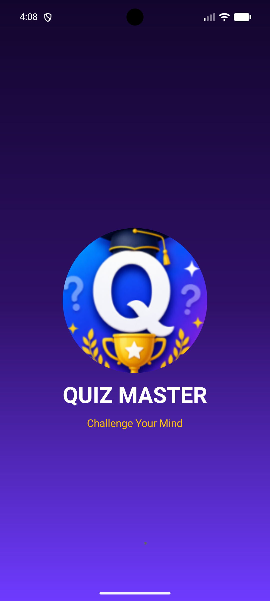
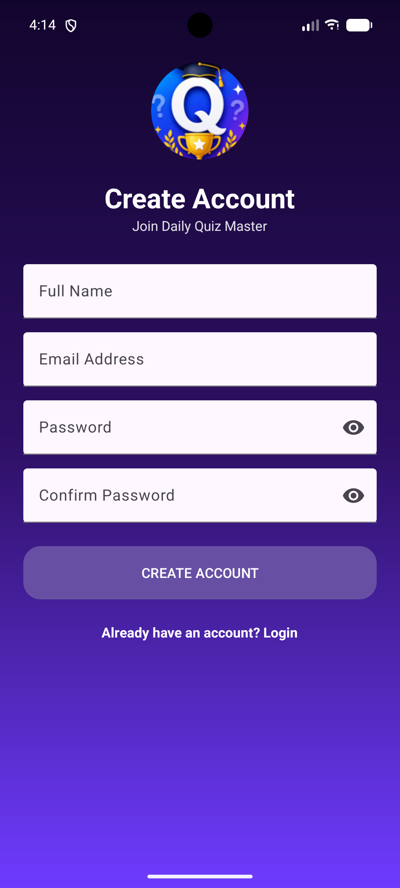
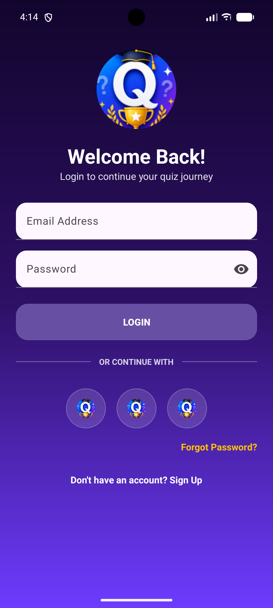
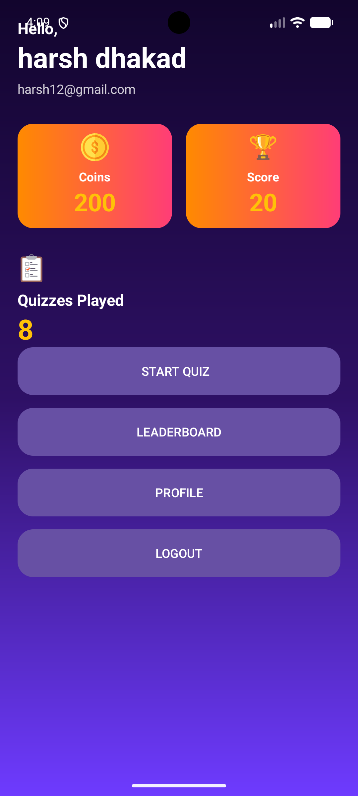
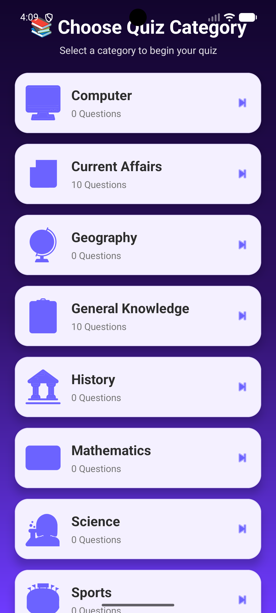
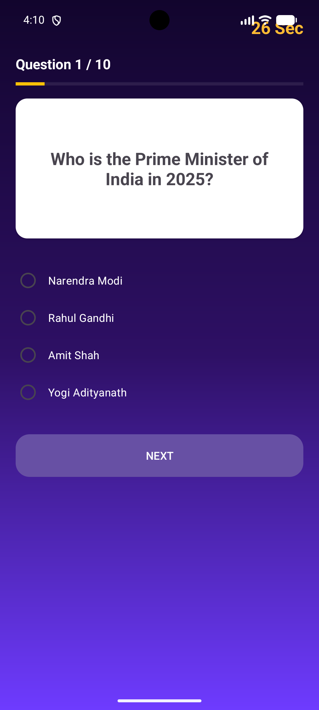
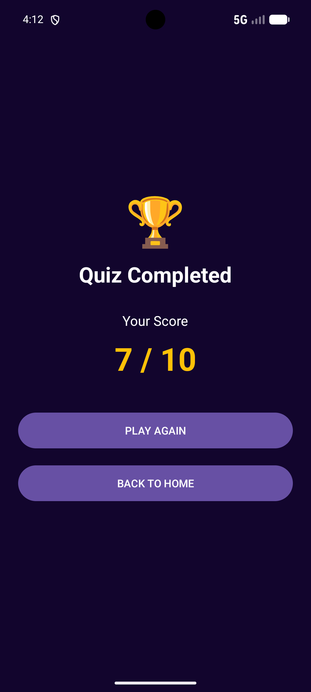

# 🧠 Quiz Master App

## 📌 Intern Information

- **Intern ID:** CITS3045
- **Name:** Harsh Dhakad
- **Company:** CODTECH IT Solutions
- **Domain:** Android Development
- **Duration:** 4 Weeks

---

# 📱 Project Name

Quiz Master App

---

# 📖 Project Description

The Quiz Master App is a modern Android quiz application developed using **Java** in **Android Studio**. It uses **Firebase Authentication** for secure user login and registration, while **Cloud Firestore** stores quiz categories, questions, user profiles, scores, and leaderboard data. The app offers an engaging quiz experience with multiple categories, score tracking, achievements, and an attractive Material Design user interface.

---

# ✨ Features

- 🔐 Firebase Authentication (Login & Register)
- 👤 User Profile
- 📚 Multiple Quiz Categories
- ❓ Multiple Choice Questions
- ⏱ Countdown Timer
- 🎯 Score Calculation
- 🏆 Leaderboard
- 🪙 Coins & Rewards System
- ⭐ XP & Level Progress
- 🎖 Achievements
- 📊 Quiz Result Screen
- 📈 Performance Statistics
- 🎨 Modern Material UI
- 📱 Responsive Design

---

# 🛠 Technologies Used

- Java
- Android Studio
- XML
- Firebase Authentication
- Cloud Firestore
- Material Design Components
- RecyclerView
- ConstraintLayout
- Glide
- Lottie Animation

---

# 🎯 Project Scope

The Quiz Master App is designed to provide users with an interactive learning experience through quizzes across various categories. It demonstrates the integration of Firebase services with Android development while implementing secure authentication, cloud-based data storage, leaderboard management, and a professional user interface.

---

# 📂 Repository Contains

- ✔ Source Code
- ✔ README File
- ✔ Screenshots
- ✔ Documentation
- ✔ Output Images

---

# 🚀 Future Improvements

- 🌐 Online Multiplayer Quiz
- 🎤 Voice-Based Questions
- 🖼 Image-Based Questions
- 📢 Push Notifications
- 🌙 Dark Mode
- 🎁 Daily Rewards
- 🧩 Daily Challenge
- 🌍 Multi-Language Support
- ☁ Firebase Cloud Storage for Profile Images
- 🤖 AI-Based Quiz Recommendations

---

# 📸 Screenshots

## Splash Screen

## Signup Screen

## Login Screen

## Home Screen

## Categories Screen

## Quiz Screen

## Result Screen

## Leaderboard

## Profile Screen

---

# 📄 Documentation

Project Documentation:

- [Quiz_Master_App_Documentation.pdf](Documentation/Daily_Quiz_Master_App_Documentation.pdf)

---

# 👨‍💻 Developer

**Harsh Dhakad**

CODTECH Android Development Internship
